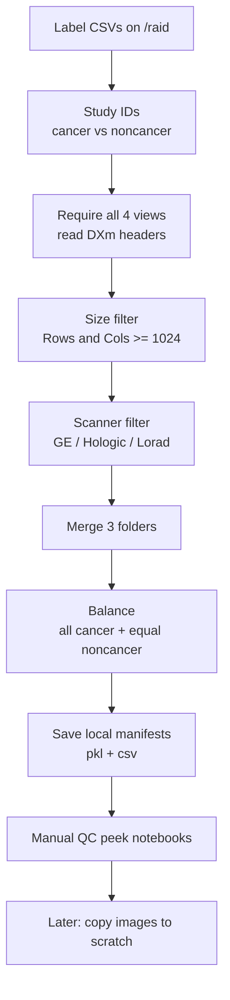

```mermaid
flowchart TD
  A[Label CSVs on /raid] --> B[Study IDs<br/>cancer vs noncancer]
  B --> C[Require all 4 views<br/>read DXm headers]
  C --> D[Size filter<br/>Rows and Cols >= 1024]
  D --> E[Scanner filter<br/>GE / Hologic / Lorad]
  E --> F[Merge 3 folders]
  F --> G[Balance<br/>all cancer + equal noncancer]
  G --> H[Save local manifests<br/>pkl + csv]
  H --> I[Manual QC peek notebooks]
  I --> J[Later: copy images to scratch]
```
